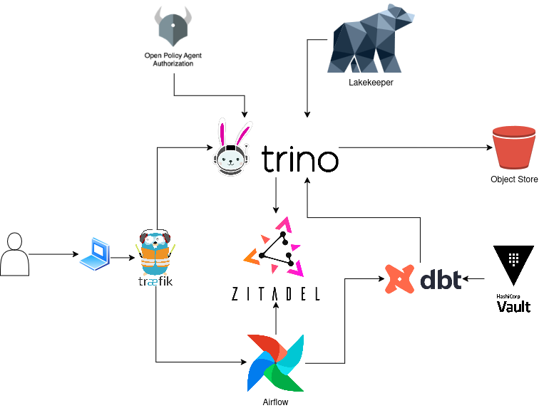

# Data Platform Stack

This repository contains the code discussed in the following blogpost [Rethinking data platforms in the age of digital sovereignty](https://medium.com/datamindedbe/portable-by-design-rethinking-data-platforms-in-the-age-of-digital-sovereignty-8ccbfd8e549f).
The project consists of the infrastructure for each of the EU cloud providers as well as the opensource components that make up the data platform.
* The open source components are:
  * Trino
  * Airflow
  * Open Policy Agent
  * Hashicorp Vault
  * ArgoCD
  * Zitadel
* The infrastructure required for the following EU-based providers
  * OVH
  * Scaleway
  * UpCloud
  * Exoscale

## Architecture

The core of the platform is a Trino cluster, providing a SQL-like interface to data. This is used by
* data engineers who can query the data via a database client 
* jobs scheduled by Airflow

Supporting components:
* Zitadel - for single sign on
* ArgoCD - for application deployment
* Vault - for secrets management
* Open Policy Agent - for authorization of Trino queries

## Interacting with the Platform
The Data Engineers interact with the platform via the Airflow UI and via a database client connecting to Trino.

# Deploying the platform
## Tools needed
* [OpenTofu](https://opentofu.org/) 
* [Kubectl](https://kubernetes.io/docs/reference/kubectl/)
* [Helm](https://helm.sh/)

## Requirements
* make sure you have a hostname for this project, lots of services require SSL, which requires a valid hostname.
* fork this repo because you will need to change some values
* pick a cloud provider and make sure you can authenticate terraform (you can run this locally, but it is tricky to get the SSL certificates right)
  * OVH https://registry.terraform.io/providers/ovh/ovh/latest
  * UpCloud https://registry.terraform.io/providers/UpCloudLtd/upcloud/latest
  * Scaleway https://registry.terraform.io/providers/scaleway/scaleway/latest
  * Exoscale https://registry.terraform.io/providers/exoscale/exoscale/latest
  * It is possible to run this on Hetzner + Cloudfleet (this combo only gives you k8s and object store, no managed databases)

## Infra deployment
* pick a provider in the `infra` folder and follow the instructions from the `README.md` in that folder
* follow the readme in the `bootstrap-data-platform` folder to setup argocd.
* if needed, continue bootstrapping the platform with the relevant infra provider (databases, credentials etc)

## Deploy some ETL jobs
* deploy the Airflow DAGs

# Contributors

