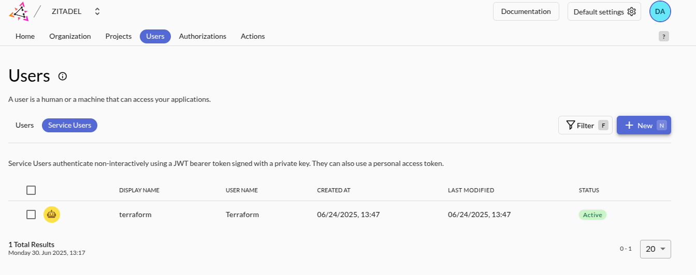
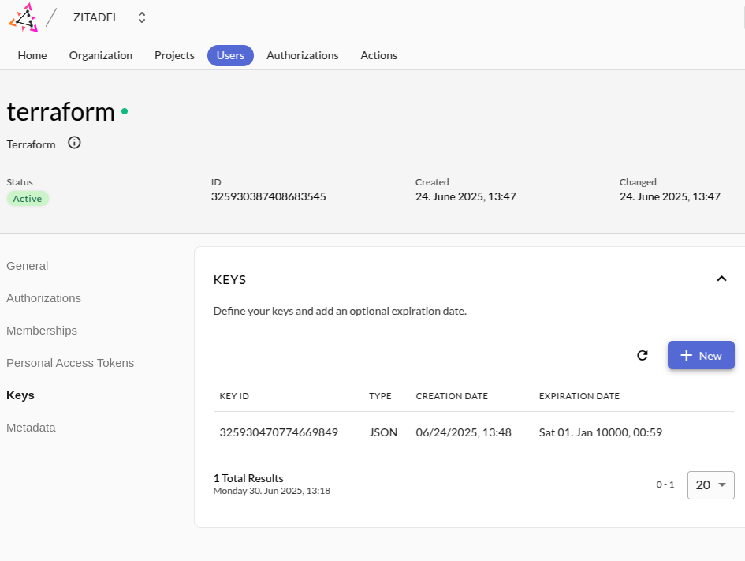

# Scaleway Platform

## Prerequisites
Make sure you have a working Scaleway account.

## Getting started
Before you are able to use the Terraform code, go the [Scaleway console](https://console.scaleway.com) and make sure you have the following information:
- Generate an access key for your user or application: https://console.scaleway.com/iam/users
- Make sure the user/application has the necessary permissions to create resources in the project you want to use.
- Create a project in the Scaleway console, or copy the ID of the default project from the console.
- Copy the organization ID from the [console](https://console.scaleway.com/organization).

Now you can create a `.env` file in the root of this directory based on the `.env.template` file.
Source the environment variables in your terminal after filling in the necessary values.

1. Replace the project_id with your own in `bootstrap/main.tf`. Afterwards run `tofu init` and `tofu apply` in the bootstrap directory to create the state bucket.
2. Adjust the project_id, organization_id in `data-platform/main.tf`. Run `tofu init` and `tofu apply` in the `data-platform` directory to create the data platform resources.
   Note: you will need the name of the bucket created in the previous step, so make sure to copy it.
3. follow the instructions in `bootstrap-data-platform`
4. run `tofu apply` again so it sets the zitadel credentials correctly
5. after this, zitadel should be up and running

In order to create OIDC resources for Zitadel, you need to create a jwt_token in the Zitadel UI (e.g. https://zitadel.ovh.playground.dataminded.cloud/ui/console/org).
- Go to the service users tab and create a new service user. 
- For this service user, create a key, Zitadel will create the json key that you need for the Terraform provider. 
- Put the key in the zitadel directory as `token.json`

6. Replace the zitadel organization_id in `zitadel/app.tf` with the organization ID from the Zitadel UI.
7. run `tf apply` in the `zitadel` directory to create the OIDC resources for Zitadel.